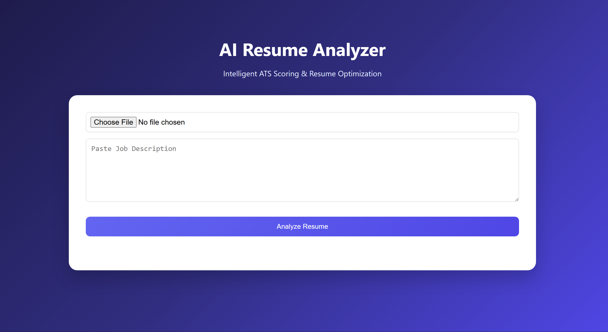
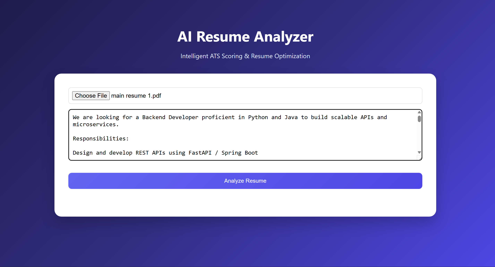
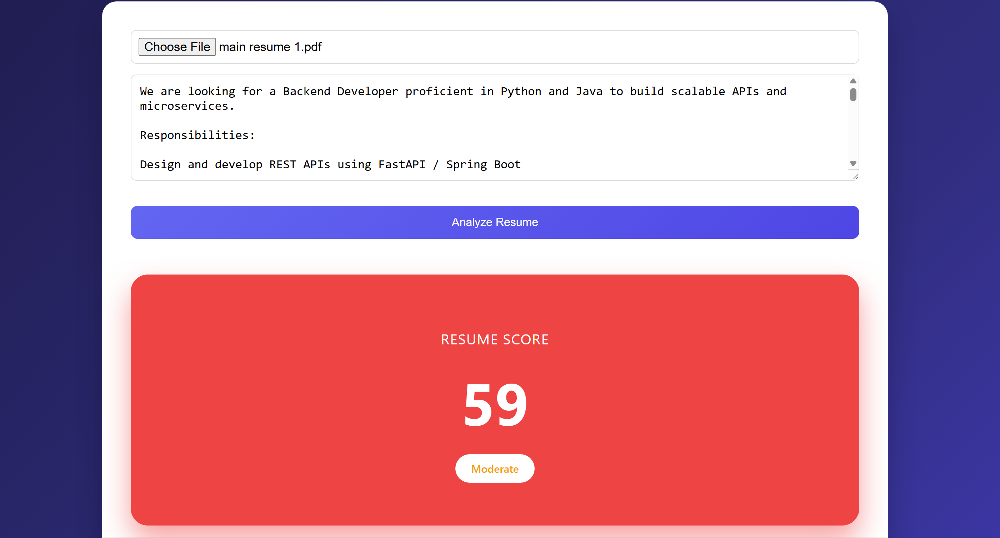
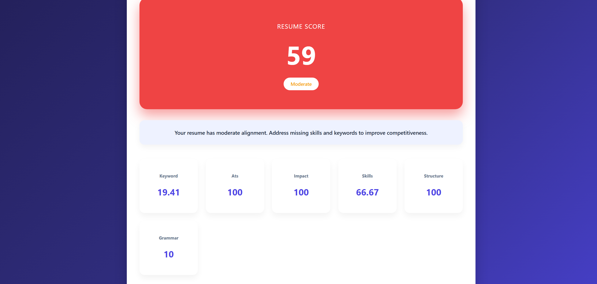

# 📄 AI Resume Analyzer

An AI-powered web application that evaluates resumes against job descriptions using NLP and machine learning to generate ATS scores, insights, and improvement suggestions.

---

## 🚀 Overview

This project helps users understand how well their resume matches a job description by analyzing skills, keywords, structure, and overall alignment.

It is designed to simulate real-world ATS (Applicant Tracking System) behavior.

---

## ✨ Features

- 📄 Upload Resume (PDF)
- 📝 Paste Job Description
- 🤖 NLP-based Resume Analysis
- 📊 ATS Score Calculation (0–100)
- 🔍 Keyword & Skill Matching
- 📈 Detailed Breakdown (Skills, Impact, Structure, ATS)
- 📊 Visual Analytics (Radar Chart)
- 💡 Smart Suggestions for Improvement

---

## 📸 Screenshots

| Upload | Input | Result | Analysis |
|--------|------|--------|----------|
|  |  |  |  |

---

## 🧠 How It Works

1. Extracts text from uploaded resume
2. Processes job description input
3. Converts text into embeddings
4. Calculates similarity using NLP models
5. Generates ATS score and insights
6. Identifies missing skills and suggestions

---

## 🛠 Tech Stack

- **Frontend:** React.js
- **Backend:** FastAPI
- **Machine Learning:** Sentence Transformers (NLP)
- **Languages:** Python, JavaScript
- **Deployment:** Netlify (Frontend), Render (Backend)

---

👨‍💻 Author
Pranesh S

⭐ Support

If you like this project, give it a ⭐ on GitHub!
